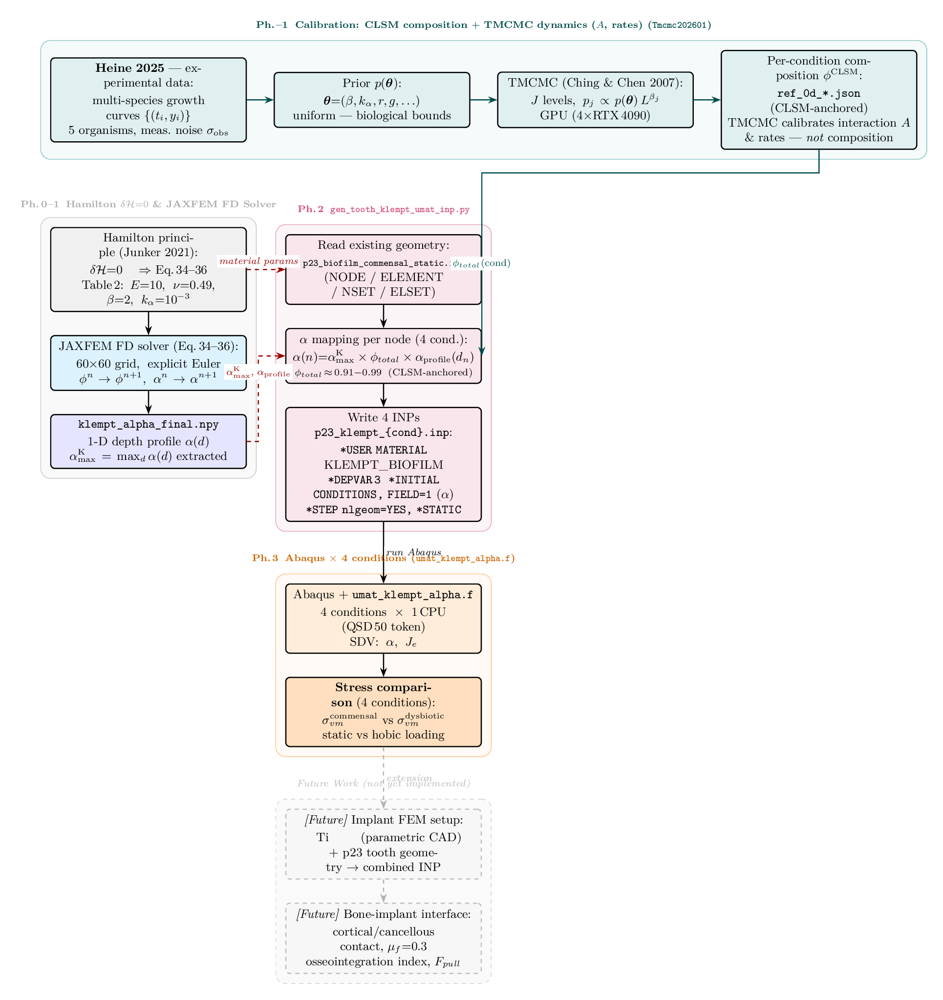

# pde-fem-biofilm

**3D finite-element stress analysis of oral biofilms, built on the Klempt (2024)
continuum growth model.**
口腔バイオフィルムの連続体成長モデル（Klempt 2024）に基づく 3D FEM 応力解析。

Companion code for the LUH / IKM master's thesis and the Nishioka–Heine biofilm
paper. The pipeline turns a TMCMC-calibrated 5-species ecology model and
CLSM-measured composition into condition-resolved mechanical stress on
tooth / implant geometry.

---

## Pipeline

```
CLSM species fractions ──▶ composition φ (per species, per condition)
                              │
            ┌─────────────────┴──────────────────┐
            ▼                                     ▼
   stiffness  E(φ)                       growth variable  α(x)   ← PDE (Eq. 34–36)
            │                                     │
            └────────────────┬────────────────────┘
                             ▼
        FEM with Klempt UMAT :  F = Fe·Fg ,  Fg = (1+α) I   (isotropic growth)
                             ▼
        max von Mises  σ   ──▶   stress ratio  σ_CH / σ_DH
```



*As-implemented method flow (`JAXFEM/algo_flow_tooth_reality.tex`): per-condition
CLSM composition + TMCMC-calibrated dynamics (interaction matrix A) → JAXFEM PDE
α-field → tooth Abaqus UMAT (isotropic `Fg=(1+α)I`) → 4-condition von Mises
comparison.*

- **Composition φ is CLSM-measured.** TMCMC calibrates the species **interaction
  matrix A** and rate parameters — *not* the composition (the 15-D inverse
  problem is under-identified; see the audit below).
- **Growth is isotropic** `Fg = (1+α) I` (Klempt 2024), implemented in the
  production UMAT `umat_klempt_alpha.f` (`Fg = s·I, s = 1+α`).

### Conditions

`CH` commensal-HOBIC · `DH` dysbiotic-HOBIC · `CS` commensal-static · `DS` dysbiotic-static.

### Headline result

`σ_CH / σ_DH ≈ 6.44×` for **early biofilm** (timepoint-dependent: ~6× early →
~2× mature). The ratio is **robust** to the depth/nutrient model (5.3–6.6× via a
3D reaction–diffusion treatment) but **sensitive** to the assumed per-species
stiffness `E_SPEC` (3.7–12×). The full `σ(t)` trajectory is reported rather than a
single number. Authoritative details: **[VERIFICATION_SENSITIVITY_LIMITATIONS.md](VERIFICATION_SENSITIVITY_LIMITATIONS.md)**.

---

## What's verified vs. assumed

| | Status |
|---|---|
| Constitutive core (`Fg=(1+α)I`, consistent tangents, mesh convergence, dual-UMAT cross-check) | 🟢 verified to continuum-mechanics (IKM) standard |
| Composition provenance (CLSM-anchored; TMCMC → A-matrix) | 🟢 corrected and documented |
| Per-species stiffness `E_SPEC` | 🟡 assumed; order-of-magnitude only (needs species AFM) — reported as a sensitivity band |
| Growth magnitude `α` | 🟡 magnitude data-anchored (thickness 1.5–3.5× → α 0.5–2.5); not per-condition calibrated |

See [rigor_audit_growth_2026-06-26.md](rigor_audit_growth_2026-06-26.md) and
[DS_composition_fix.md](DS_composition_fix.md) (a dysbiotic-static composition
copy-bug that made σ_DS ~8× too high, now fixed end-to-end).

---

## Two analysis lineages (this repo holds both)

1. **Klempt growth-stress pipeline** — the verified core above
   (`umat_klempt_alpha.f`, `gen_tooth_klempt_umat_inp.py`, `JAXFEM/`,
   the `algo_flow*.tex` method figures). This is the thesis headline.
2. **DI-bridge FEM analysis** — an alternative bridging variable
   (Dysbiosis Index → `E(DI)` + transverse isotropy), documented in
   **[FEM_README.md](FEM_README.md)**. Its absolute moduli are quoted on a
   *nominal* GPa scale; the stress/displacement **ratios** are scale-invariant
   (the physical biofilm modulus is Pa–kPa, cf. the Nishioka–Heine paper).

A standalone JAX PDE testbed for the Klempt equations lives in
**[JAXFEM/README.md](JAXFEM/README.md)**.

---

## Repository map

### Start here
| File | What |
|---|---|
| [VERIFICATION_SENSITIVITY_LIMITATIONS.md](VERIFICATION_SENSITIVITY_LIMITATIONS.md) | Consolidated rigor audit (Verification / Sensitivity / Limitations) — read this first |
| [PLAN_NEXT.md](PLAN_NEXT.md) | Prioritized next-steps roadmap (thesis freeze / first paper / continuation) |
| [PIPELINE.md](PIPELINE.md) | Config-driven pipeline entry point (`pipeline.py`) + `P[σ>τ]` risk metric |
| [methods_supplement_fem.md](methods_supplement_fem.md) | Methods supplement (DI timepoint, E(φ), TMCMC→Monod) |
| [FEM_README.md](FEM_README.md) | DI / FEM / anisotropy reference (the second lineage) |
| [JAXFEM/README.md](JAXFEM/README.md) | JAX PDE reproduction suite (Klempt Eq. 34–36) |

> The rigor-audit findings (2026-06-26), methods, plans and overviews are
> catalogued in **[DOCS.md](DOCS.md)** — the complete, categorized documentation
> index. Historical working notes are under [`archive/`](archive/).

### Figures

Three TikZ figure libraries — each figure is an `\input`-able body with a
`*_standalone.tex` wrapper; rendered PNGs live in `assets/`.

| Directory | What | Engine |
|---|---|---|
| `JAXFEM/algo_flow*.tex` | Pipeline flowcharts (the one embedded above + full-PDE / TMCMC / implant / roadmap variants) | xelatex/lualatex (CJK) |
| [`umat_flow/`](umat_flow/README.md) | UMAT algorithm flows (viscoelastic 1-ch / 2-ch / phase-2 exact tangent, USDFLD) | pdflatex (Times) |
| [`ch5_flow/`](ch5_flow/README.md) | Chapter-5 concept figures — operator splitting, cross-diffusion FV, VE-vs-poro, 5-species Voigt UMAT, Hamilton variational, data pipeline, CZM traction–separation, boundary conditions, impl architecture, V&V convergence + hierarchy, time-scale separation, growth kinematics `F=Fe·Fg`, mixed-mode fracture | pdflatex (Times) |

Build a figure (regenerating its PNG) with the engine noted above, e.g. the
embedded pipeline figure:

```bash
cd JAXFEM
xelatex algo_flow_tooth_reality_standalone.tex          # CJK content → xelatex/lualatex
gs -dBATCH -dNOPAUSE -sDEVICE=png16m -r200 \
   -sOutputFile=../assets/algo_flow_tooth_reality.png \
   algo_flow_tooth_reality_standalone.pdf
```

The `umat_flow/` and `ch5_flow/` figures build with plain `pdflatex` (see each
directory's README for the per-figure list and build commands). **For print,
embed the vector `.tex`/PDF, not the PNG.**

---

## Key entry points

| Script / dir | Role |
|---|---|
| `pipeline.py` + `configs/*.json` | **Config-driven entry point**: posterior → PDE α → stress CI → risk, staged (see [PIPELINE.md](PIPELINE.md)) |
| `JAXFEM/risk_metric.py` · `risk_field.py` | Clinical risk metric `P[σ>τ]` — scalar (per condition) and per-location field (Fig. 4) |
| `JAXFEM/` | JAX FD forward solver for φ–c–α; `posterior_klempt_stress_ci.py` (stress credible interval); algo_flow figures |
| `gen_tooth_klempt_umat_inp.py` | Generate the 4-condition tooth Abaqus INPs (α field + Klempt UMAT) |
| `biofilm_conformal_tet.py` | Conformal-tet biofilm growth (`--mode substrate|biofilm`, `--neo-hookean`) |
| `run_material_sensitivity_sweep.py` | E_max / E_min / n material sweep (DI lineage) |
| `run_aniso_comparison.py` | Transverse-isotropy (∇φ_Pg) Abaqus sweep |
| `umat_biofilm_visco.f` | Viscoelastic UMAT `F=Fe·Fv·Fg` with exact algorithmic tangent (perturbation, Sun et al. 2008) |
| `usdfld_biofilm.f` | USDFLD for the DI → E field mapping |

> The production isotropic Klempt UMATs (`umat_klempt_alpha.f`,
> `umat_klempt_voigt.f`, `umat_klempt2025.f`) live in the coupling prototype:
> `nife/masterarbeit_ansys_fem/coupling_prototype/abaqus/`.

---

## References

- **Klempt et al. (2024)** — biofilm continuum growth model, *Biomech. Model. Mechanobiol.*
- **Wriggers & Junker (2024)** — Hamilton-principle diffusion-driven biofilm growth, *CMAME*
- **Junker & Balzani (2021)** — Hamilton model for biofilm mechanics
- **Sun, Chaikof & Levenston (2008)** — consistent algorithmic tangent by perturbation
- **Nishioka–Heine (2025)** — TMCMC 5-species oral biofilm calibration (companion paper)
