# Chapter-5 flow / concept figures

TikZ figures for the thesis Chapter 5 (spatial reaction–diffusion model, UMAT
growth, cohesive delamination) and the surrounding theory / data-pipeline
overview. Same visual style as `JAXFEM/algo_flow*.tex` and `umat_flow/`, **Times**
font (`mathptmx`), plain `pdflatex`.

Each `*.tex` body is `\input`-able and ships a `*_standalone.tex` wrapper;
high-resolution PNGs (Times, 200 dpi) live in `../assets/`.

| # | Figure (`\input`) | Thesis § | Shows |
|---|---|---|---|
| 2 | `flow_operator_splitting` | 5.3.2 | Lie operator-splitting RD-PDE solver: stiff implicit reaction + conservative transport, Newton & CFL loops |
| 3 | `flow_multiphysics_chain` | 5.4 | 16S/FISH dysbiosis → UMAT growth → cohesive delamination (closed energy chain) |
| 4 | `flow_crossdiffusion_fv` | 5.3.3 | Volume-filling (size-exclusion) cross-diffusion finite-volume face flux; simplex-exact, no clipping |
| 5 | `flow_ve_vs_poro` | 5.4.6 | Viscoelastic (Prony/Burgers) vs poroelastic (Terzaghi) relaxation channels |
| 6 | `flow_5species_voigt_umat` | 5.4.6 | 5-species Voigt mixing + species-specific growth split, UMAT Gauss-point loop |
| 7 | `flow_hamilton_variational` | theory | Extended Hamilton principle: one functional Π, `δΠ=0` → mechanics + material-point eqs |
| 8 | `flow_data_pipeline` | overview | End-to-end: CLSM/FISH images → TMCMC inference → FEM mapping → prediction |
| 10 | `flow_czm_traction_separation` | 5.x | Cohesive zone model: traction–separation law, damage `D:0→1`, delamination |
| 12 | `flow_boundary_conditions` | 5.x | Multiscale BCs on Ti / biofilm / fluid layers (mech + chem + lateral) |
| 13 | `flow_impl_architecture` | impl | Python(JAX) ↔ bridge (socket / `ISO_C_BINDING`) ↔ Fortran UMAT ↔ commercial FEM |
| 14 | `flow_vv_convergence` | App. C | PDE V&V: analytic vs finite-volume + log-log 2nd-order (`O(Δz²)`) convergence |
| 15 | `flow_timescale_separation` | 5.x | Biology (days) vs mechanics (ms–s) time-scale separation (gear-meshed loops) |

## Build

```bash
cd ch5_flow
pdflatex flow_operator_splitting_standalone.tex
gs -dBATCH -dNOPAUSE -sDEVICE=png16m -r200 -dTextAlphaBits=4 -dGraphicsAlphaBits=4 \
   -sOutputFile=../assets/flow_operator_splitting.png flow_operator_splitting_standalone.pdf
```

Packages: `amsmath, amssymb, mathptmx` (Times), `bm`, TikZ libraries
`shapes.geometric, arrows.meta, positioning, fit, backgrounds, calc`.
Embed in the thesis with
`\resizebox{\linewidth}{!}{\input{ch5_flow/flow_operator_splitting.tex}}`.

> Labels are in English to match `umat_flow/` and the `Times` font (a Latin
> serif). Ask if Japanese (CJK) versions are needed — those require `xelatex`
> with a Japanese font instead of `mathptmx`.

## Preview

### §5.3.2 — operator-splitting RD-PDE solver
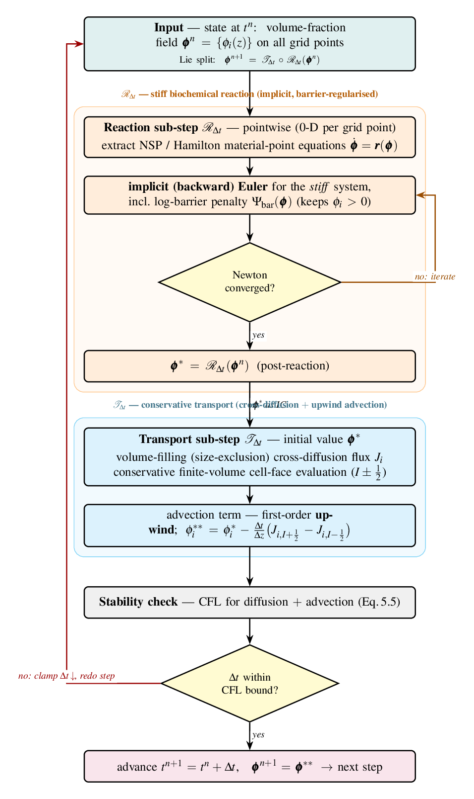

### §5.4 — multiphysics coupling chain
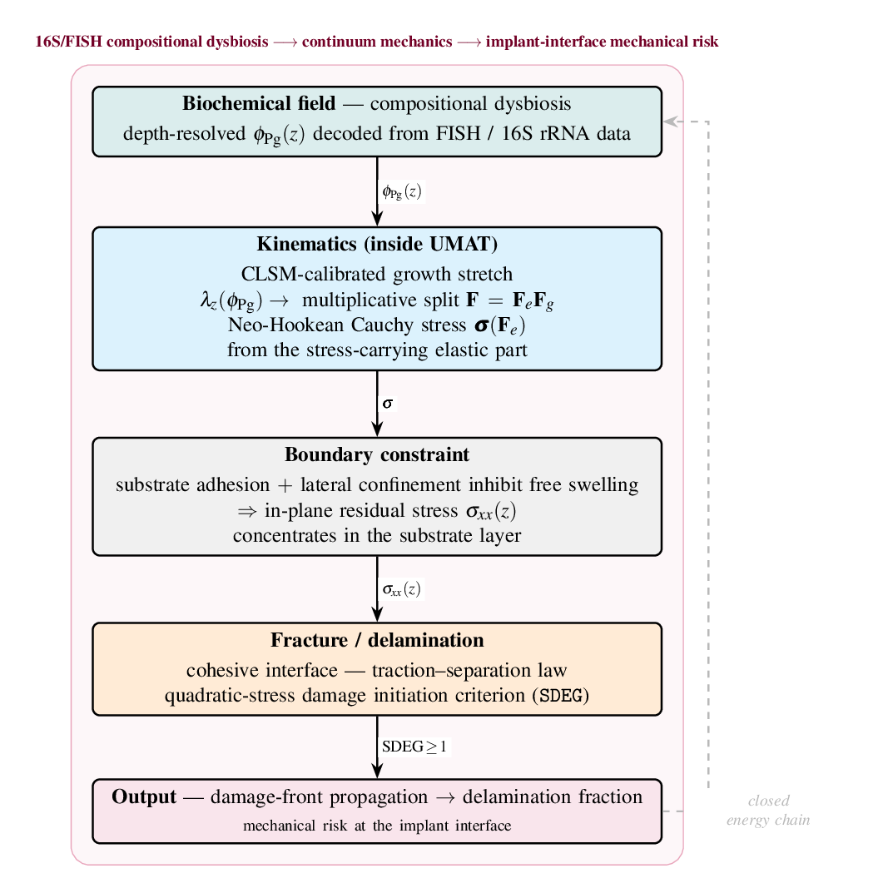

### §5.3.3 — cross-diffusion finite-volume flux
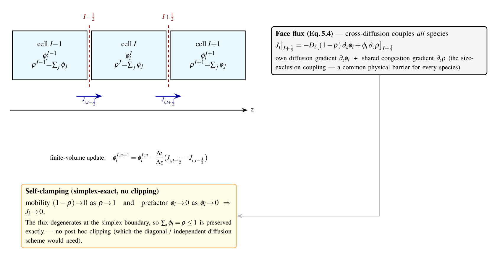

### §5.4.6 — viscoelastic vs poroelastic relaxation
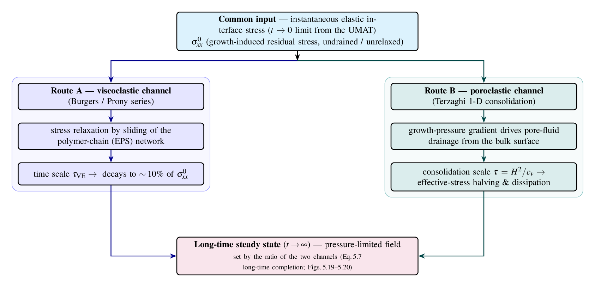

### §5.4.6 — 5-species Voigt mixing + growth (UMAT loop)
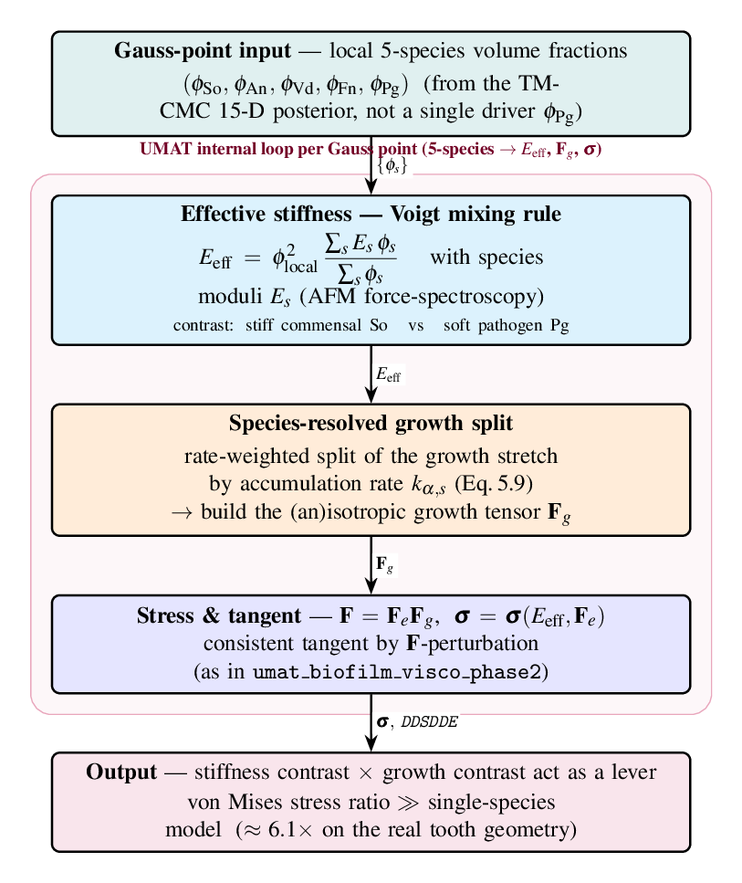

### Extended Hamilton principle — variational structure
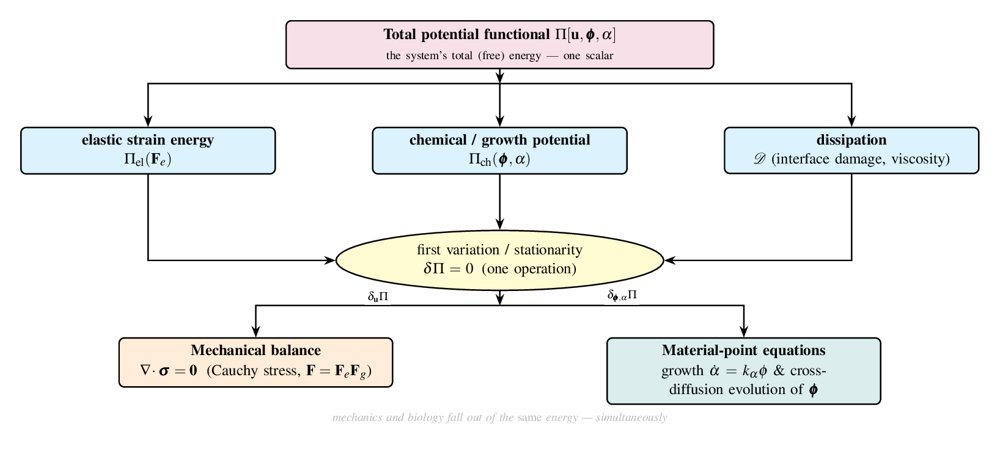

### End-to-end data pipeline
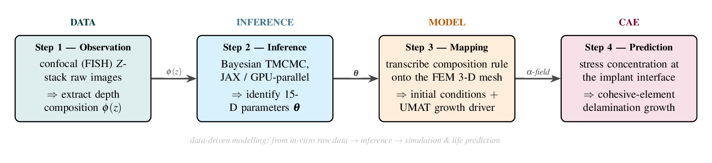

### Cohesive zone model — traction–separation law
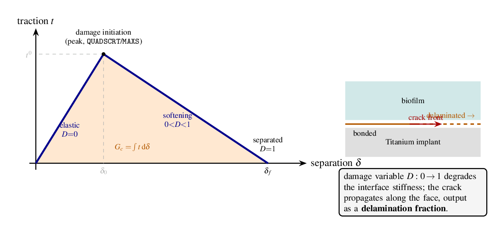

### Multiscale boundary conditions
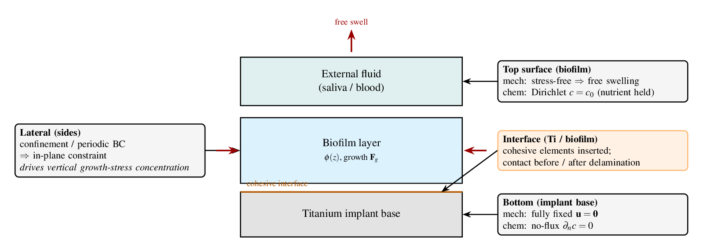

### Implementation architecture (Python ↔ Fortran ↔ FEM)
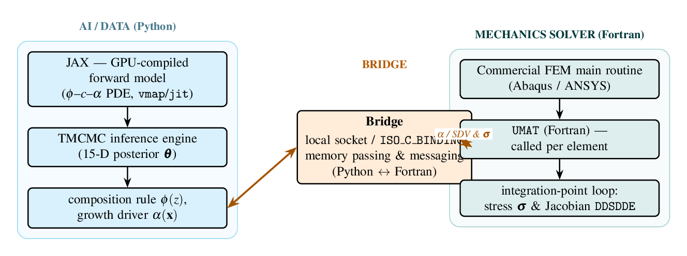

### PDE V&V and error convergence (Appendix C)
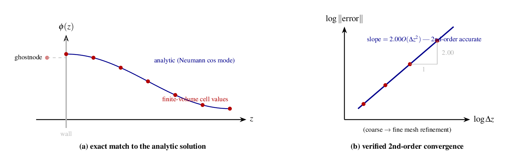

### Biology / mechanics time-scale separation
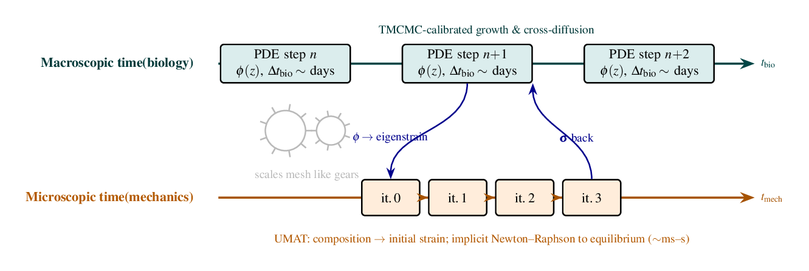
