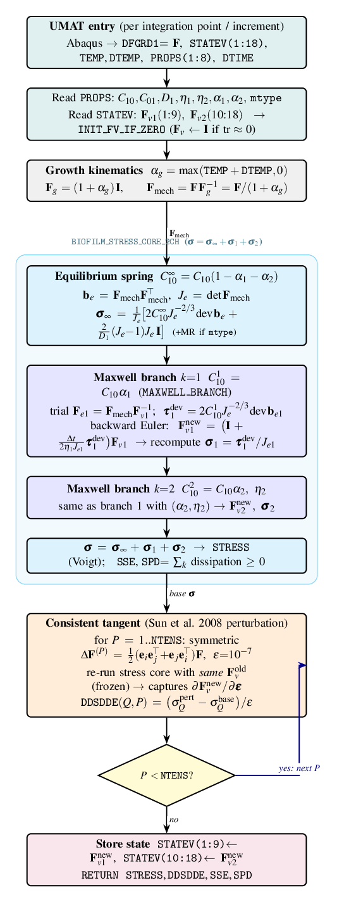
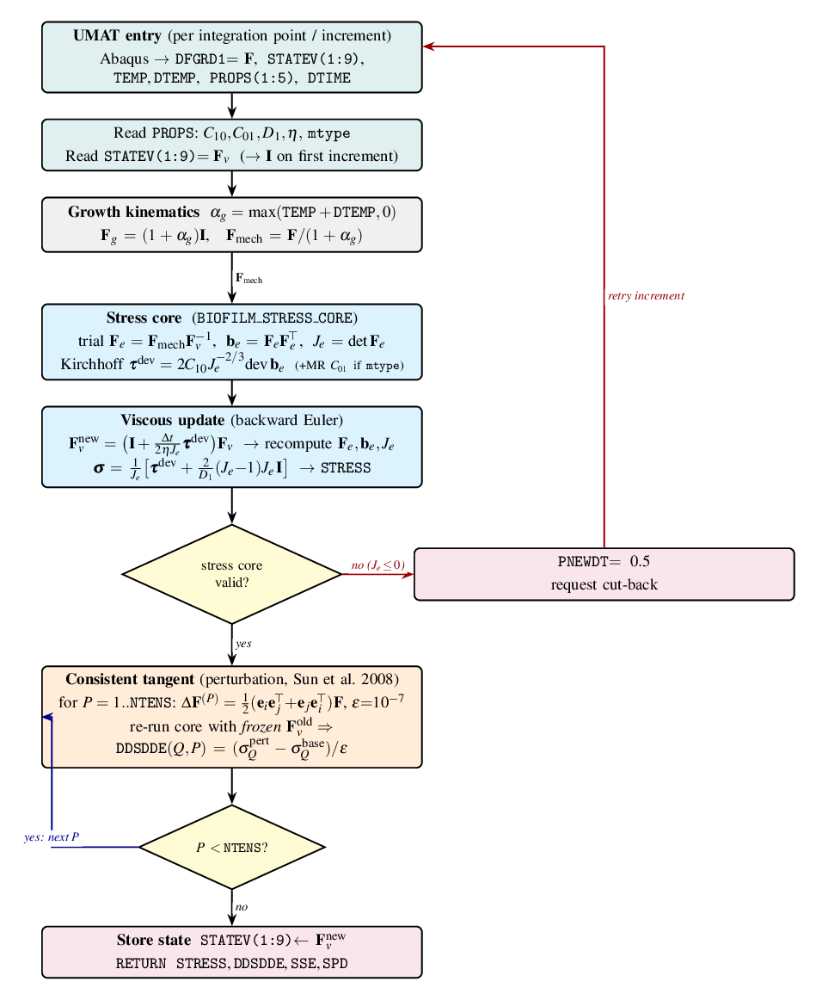
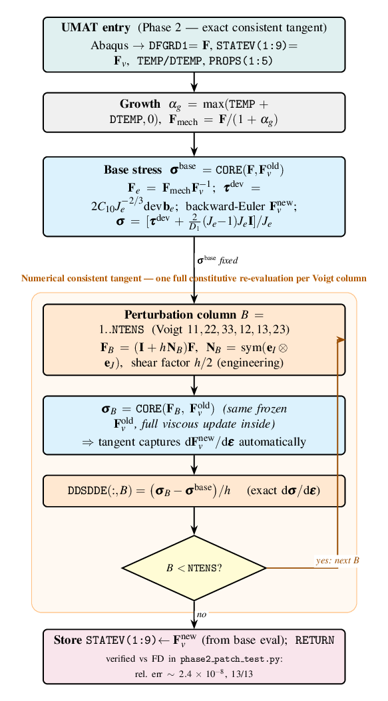
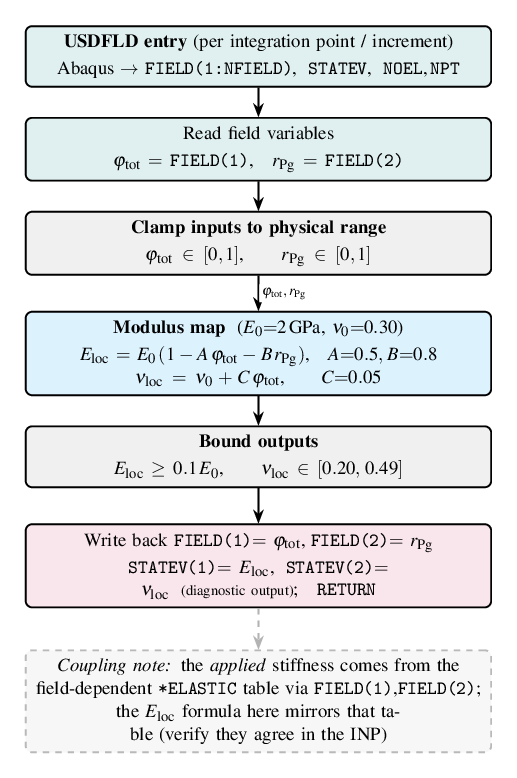

# UMAT algorithm-flow figures

TikZ flowcharts of the constitutive subroutines in this repo — one per
subroutine. They mirror the algorithm actually implemented in the Fortran
(kinematics → stress core → viscous update → consistent tangent → state store),
in the same visual style as `JAXFEM/algo_flow*.tex`.

| Body (`\input`-able) | Standalone wrapper | Subroutine | Shows |
|---|---|---|---|
| `umat_flow_visco.tex` | `umat_flow_visco_standalone.tex` | `umat_biofilm_visco.f` | 1-channel `F=Fe·Fv·Fg`, backward-Euler `Fv`, perturbation tangent, `PNEWDT` cut-back |
| `umat_flow_visco_phase2.tex` | `umat_flow_visco_phase2_standalone.tex` | `umat_biofilm_visco_phase2.f` | 1-channel with the **exact** algorithmic tangent (per-Voigt-column re-evaluation) |
| `umat_flow_visco_2ch.tex` | `umat_flow_visco_2ch_standalone.tex` | `umat_biofilm_visco_2ch.f` | 2-channel Prony (`σ=σ∞+σ₁+σ₂`) + isotropic growth |
| `umat_flow_usdfld.tex` | `umat_flow_usdfld_standalone.tex` | `usdfld_biofilm.f` | DI-bridge field routine `E(DI), ν(DI)` |

## Preview

Rendered (Times, `pdflatex` → PNG). Regenerate with the Build commands below.

### `umat_biofilm_visco_2ch.f` — 2-channel Prony viscoelastic + growth


### `umat_biofilm_visco.f` — 1-channel viscoelastic (with `PNEWDT` cut-back)


### `umat_biofilm_visco_phase2.f` — 1-channel, exact algorithmic tangent


### `usdfld_biofilm.f` — DI-bridge field routine `E(DI), ν(DI)`


## Build

```bash
cd umat_flow
pdflatex umat_flow_visco_2ch_standalone.tex           # → PDF
# optional raster:
gs -dBATCH -dNOPAUSE -sDEVICE=png16m -r150 \
   -sOutputFile=umat_flow_visco_2ch.png umat_flow_visco_2ch_standalone.pdf
```

All four use `amsmath, amssymb, mathptmx` (**Times** text + math), `bm`, and the
TikZ libraries `shapes.geometric, arrows.meta, positioning, fit, backgrounds,
calc` — plain `pdflatex` (no CJK, unlike the `algo_flow` figures which need
`xelatex`). To match a different report font, swap the `mathptmx` line in each
`*_standalone.tex` wrapper (or drop it to fall back to Computer Modern).

## Embed in a report

```latex
\begin{figure}[t]\centering
  \resizebox{0.6\linewidth}{!}{\input{umat_flow/umat_flow_visco_2ch.tex}}
  \caption{Per-increment algorithm flow of the 2-channel viscoelastic UMAT.}
\end{figure}
```

Node colour legend (shared): teal = Abaqus I/O · gray = kinematics ·
cyan = elastic/stress core · blue = viscous branch · orange = consistent tangent ·
purple = state store · yellow diamond = loop/branch · dashed = note.
